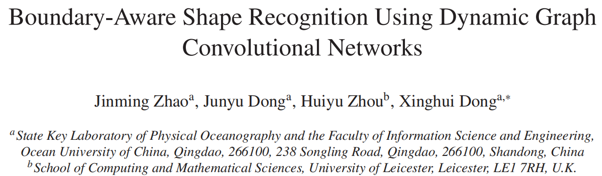
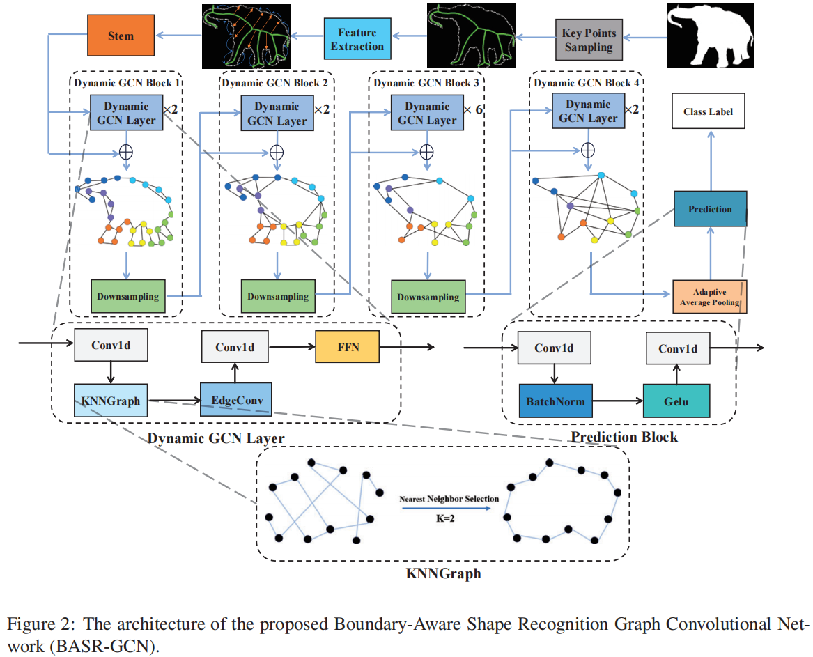

<p align="center"> 
<!-- <a href="https://www.sciencedirect.com/science/article/abs/pii/S0031320324002188" ></a> -->
<a href="https://indtlab.github.io/projects/BASR-GCN" ></a>
<a href="https://INDTLab.github.io/projects/Packages/BASR-GCN/Data/BASR-GCN.pdf" ></a>
<!-- <a href="https://indtlab.github.io/projects/WRD-Net" ></a> -->
</p>

# Architecture



# Usage
### Installation
1. Create a virtual environment named `BASR`:   
```copy
conda create -n BASR python=3.8 -y
```     
2. Activate the new environment:  
```copy
conda activate BASR
```    
3. Install dependencies:  
```
pip install torch torchvision torchaudio --index-url https://download.pytorch.org/whl/cu118
pip install numpy scikit-learn pillow opencv-python
```

### Data Sets
We provide data sets used in the paper: [MPEG-7](https://academictorrents.com/details/0a8cb3446b0de5690fee29a2c68922ff691c7f9a), [Swedish Leaf](https://www.cvl.isy.liu.se/en/research/datasets/swedish-leaf/), [Flavia](https://flavia.sourceforge.net/), [Animal](https://www.flaticon.com/packs/animal-silhouettes)


### Pre-Trained Models
You can also download th pre-trained models on the BASR: [GoogleLink]([https://drive.google.com/file/d/1D00quOYefmW_VoBnJVNjkezOa2w-aUWl/view?usp=drive_link](https://drive.google.com/drive/folders/1CPAgSfr-GnP6MW6v0TtmvhfXM1-qieng?usp=sharing))

### Train
You can use command like this:  
```copy
python train.py
```

# Citation
```
@ARTICLE{zhao2025boundary,
  title={Boundary-Aware Shape Recognition Using Dynamic Graph Convolutional Networks},
  author={Jinming Zhao, Junyu Dong, Huiyu Zhou, Xinghui Dong},
  journal={Pattern Recognition},
  volume={97},
  pages={107000},
  year={2025},
}
```
